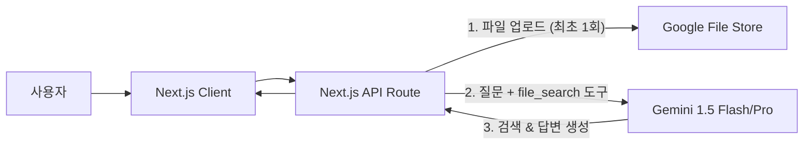

# Google File Search API 도입 검토 보고서

## 1. 개요

현재 리워크케어 산재 상담 챗봇은 **n8n + Supabase (Vector DB) + OpenAI/Anthropic** 조합의 커스텀 RAG 파이프라인을 사용하고 있습니다.
구글의 새로운 **Gemini API File Search** 기능을 도입하여 이 아키텍처를 대체할 수 있는지 분석하고, 도입 시의 장단점을 비교한 문서입니다.

## 2. Google File Search API란?

Gemini 1.5 Pro/Flash 모델에 내장된 기능으로, 사용자가 파일을 업로드하면 구글이 자동으로 **파싱(Parsing), 청킹(Chunking), 임베딩(Embedding), 벡터 저장(Vector Storage)**을 수행하고, 질문 시 관련 내용을 검색(Retrieval) 하여 답변을 생성해주는 **All-in-One RAG 솔루션**입니다.

## 3. 기존 기술 vs 신기술 비교

| 구분            | 기존 아키텍처 (Current)                                                                      | 신규 아키텍처 (Gemini FileSearch)                                                                                 |
| :-------------- | :------------------------------------------------------------------------------------------- | :----------------------------------------------------------------------------------------------------------------- |
| **구성 요소**   | Next.js -> n8n -> Supabase -> LLM                                                            | Next.js -> Google Gemini API                                                                                       |
| **구현 복잡도** | **높음 (High)**   - 임베딩, 벡터 저장 로직 직접 구현 필요   - n8n 워크플로우 관리 필요 | **낮음 (Low)**   - 파일 업로드만 하면 끝   - 검색/관리는 구글이 알아서 처리                                  |
| **유지 보수**   | - Supabase DB 관리 필요   - n8n 서버/워크플로우 관리 필요                                 | - API Key만 관리하면 됨   - 별도 DB 관리 불필요                                                                 |
| **비용 (Cost)** | - Supabase 비용   - LLM 토큰 비용   - n8n 호스팅 비용                                  | - **저장 공간 무료** (1GB~100GB)   - 임베딩 비용 ($0.15/1M token)   - 검색된 텍스트는 컨텍스트 토큰으로 과금 |
| **확장성**      | 직접 튜닝 가능 (Chunk size, Overlap 등)                                                      | 구글의 자동화된 로직(Black-box)에 의존                                                                             |
| **데이터 제한** | 스토리지 용량만큼 무제한                                                                     | **파일당 100MB** 제한   **스토어당 20GB** 권장 (속도 최적화)                                                    |
| **특이 사항**   | 텍스트 임베딩만 가능 (일반적)                                                                | **PDF, 이미지, 오디오** 등 멀티모달 파일도 바로 검색 가능                                                          |

## 4. 도입 시 장점 (Pros)

1.  **압도적인 개발 생산성**: 복잡한 RAG 파이프라인(임베딩, 벡터 DB 검색)을 구현할 필요가 없습니다. 파일만 던져주면 됩니다.
2.  **멀티모달 RAG**: 산재 신청 서식(PDF), 이미지 자료 등도 텍스트 변환 없이 바로 업로드하여 검색 가능합니다.
3.  **관리 포인트 감소**: Supabase와 n8n이라는 미들웨어를 제거하여 아키텍처가 단순해집니다.
4.  **비용 절감**: 별도 벡터 DB 비용이 들지 않으며, 저장 공간이 무료(Tier에 따라 상이)입니다.

## 5. 통합 및 마이그레이션 계획 (Integration Plan)

### 5.1. 전제 조건

- Google AI Studio API Key 발급 필요
- 기존 산재 관련 문서(PDF, TXT, MD) 원본 파일 확보

### 5.2. 변경 아키텍처

### 5.3. 구현 단계

1.  **파일 업로드 스크립트 작성**: 산재 법령/규정 파일을 Google File Store에 업로드하는 Admin용 스크립트 (`scripts/upload-to-gemini.ts`) 작성.
2.  **API Route 수정**: 기존 `app/api/chatbot/route.ts`를 수정하거나, 테스트를 위해 v2 라우트 (`app/api/chatbot-v2/route.ts`) 생성.
3.  **UI 연결**: 새로운 API를 바라보도록 클라이언트 설정 변경 (테스트용 페이지 별도 생성 가능).

## 6. 결론 및 제언

Google File Search API는 기존의 복잡한 RAG 파이프라인을 획기적으로 단순화할 수 있는 강력한 대안입니다.
특히 **유지보수 비용 감소**와 **멀티모달 지원** 측면에서 큰 이점이 있습니다.

**제안**:
먼저 **별도의 테스트 페이지(v2)**를 만들어 Gemini 기반 챗봇 성능을 검증한 후, 기존 챗봇을 대체하는 단계적 도입을 추천합니다.
