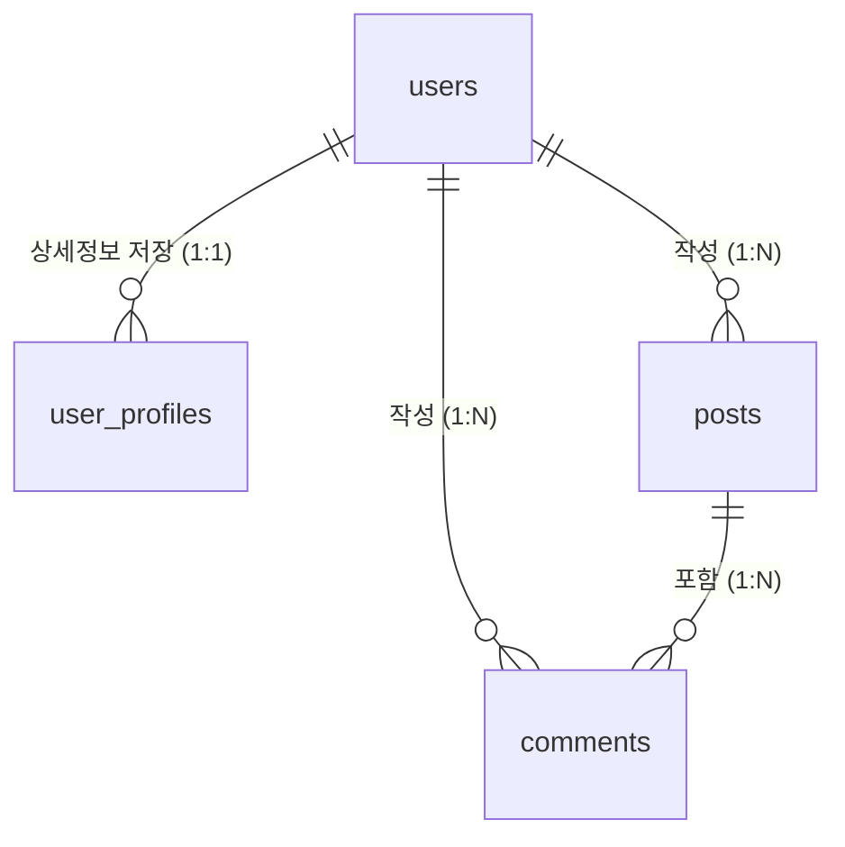

# 💾 데이터베이스 가이드 (Database Documentation)

이 문서는 ReworkCare 서비스의 데이터베이스 구조와 관리 방법을 설명합니다.
우리는 **Supabase (PostgreSQL)**를 사용하고 있습니다.

## 1. 데이터베이스 구조 (Schema Overview)

데이터는 크게 회원 정보, 병원/약국 데이터, 커뮤니티 데이터로 나뉩니다.

### 👤 사용자 관련 (Users)

| 테이블명            | 설명                | 주요 컬럼                                                      |
| ------------------- | ------------------- | -------------------------------------------------------------- |
| **`users`**         | 기본 회원 정보      | `id` (고유번호), `email` (이메일), `created_at` (가입일)       |
| **`user_profiles`** | 산재 관련 상세 정보 | `role` (환자/가족), `injury_part` (다친 부위), `region` (지역) |

### 🏥 병원 및 약국 데이터 (Facilities)

| 테이블명         | 설명                    | 주요 컬럼                                                 |
| ---------------- | ----------------------- | --------------------------------------------------------- |
| **`hospitals`**  | 산재 지정 의료기관 목록 | `name`, `address`, `phone`, `latitude`/`longitude` (좌표) |
| **`pharmacies`** | 약국 목록               | `name`, `address`, `business_hours` (영업시간)            |

### 💬 커뮤니티 (Community)

| 테이블명       | 설명   | 주요 컬럼                                            |
| -------------- | ------ | ---------------------------------------------------- |
| **`posts`**    | 게시글 | `title`, `content`, `author_id` (작성자), `category` |
| **`comments`** | 댓글   | `post_id` (연결된 글), `content`                     |

---

## 2. 테이블 관계도 (ER Diagram)

주요 테이블들이 어떻게 연결되어 있는지 보여줍니다.



---

## 3. 데이터 관리하기 (How to Manage Data)

### A. 데이터 보기 및 수정

Supabase 대시보드에서 엑셀처럼 데이터를 직접 보고 수정할 수 있습니다.

1.  [Supabase Dashboard](https://supabase.com/dashboard) 접속
2.  왼쪽 메뉴에서 **Table Editor** 클릭
3.  원하는 테이블(예: `hospitals`) 선택
4.  데이터를 더블 클릭하여 수정하거나, `Insert row` 버튼으로 추가

### B. 데이터 백업 (Backup)

소중한 데이터를 잃어버리지 않도록 주기적으로 백업해야 합니다.

1.  Supabase Dashboard -> **Database** 메뉴
2.  **Backups** 탭 클릭
3.  자동 백업(PITR)이 켜져 있는지 확인하거나, 필요할 때 수동 백업 생성

### C. 데이터가 안 보일 때 (RLS 확인)

Supabase에는 **RLS (Row Level Security)**라는 보안 규칙이 있습니다. "내가 쓴 글은 나만 수정할 수 있다" 같은 규칙입니다.

- **증상**: DB에는 데이터가 있는데 웹사이트에서는 안 보임
- **해결**: `Authentication` -> `Policies` 메뉴에서 권한 설정 확인
  - 보통 `SELECT` 정책이 `Enable` 되어 있어야 누구나 볼 수 있습니다.
  - _상세 설정법_: **[구축 가이드 Step 17](./프로젝트_구축_가이드.md#17-🛡️-supabase-rls-row-level-security-설정-mvp-마무리)**을 참고하여 AI로 정책을 생성하세요.

---

## 4. 자주 쓰는 SQL 명령어 (Cheat Sheet)

직접 명령어를 입력해서 데이터를 조회할 때 유용합니다. (`SQL Editor` 메뉴에서 사용)

**특정 지역 병원 찾기**

```sql
SELECT * FROM hospitals WHERE address LIKE '%강남구%';
```

**최근 가입한 회원 10명 보기**

```sql
SELECT * FROM users ORDER BY created_at DESC LIMIT 10;
```

**특정 사용자의 게시글 모두 보기**

```sql
SELECT * FROM posts WHERE author_id = '사용자ID';
```
